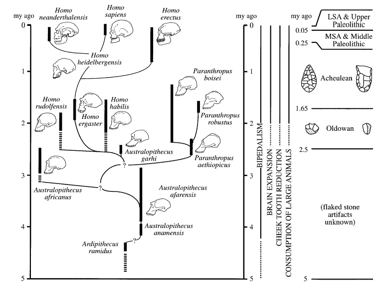
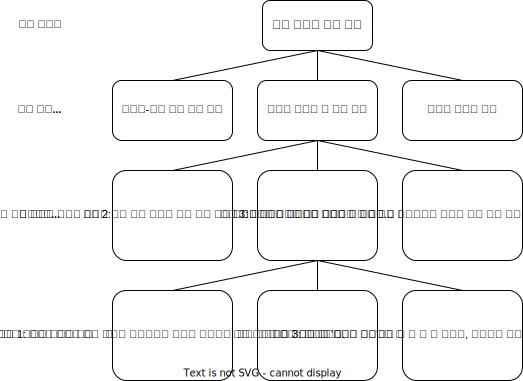

## 지난 강의 리뷰

## 수업 목표

1. 진화심리학의 발전 과정과 설명 방식에 대해 이해한다.
2. 진화심리학이 다루는 다양한 인간 본성에 대해 이해한다.
3. 창업자와 사용자로서의 마음과 행동에 숨어 있는 진화적 원인에 대해 고민해본다. 

---

::: {.r-stack style="margin-top: 200px;"}
{width="450"}
:::

# 진화심리학의 탄생

## ⟪진화심리학⟫

::: {.r-hstack}
{width="350"}

{width="400"}
:::

## 진화심리학의 탄생

- 진화적 사고와 역사에서 일어난 중요한 사건 -> 1강으로 옮겨도 됨
- 현생 인류의 기원
- 심리학 분야에서 일어난 기념비적 사건들

## 진화적 사고와 역사에서 일어난 중요한 사건 

- 

## 현생 인류의 기원

## 네안데르탈인은 왜 멸종했는가?

## 심리학 분야에서 일어난 기념비적 사건들

- 프로이트, 윌리엄 제임스
  - 진화론에 큰 영향을 받은 심리학 이론들(본능에 대한 강조)
- 행동주의
  - 1920년대부터 약 50년동안 심리학계를 지배, 진화론과 등을 돌림
  - 본능에 대한 거부, 강화 효과를 통한 학습에 대한 맹신
- 인지혁명
  - 가르시아 효과
  - 인지 현상을 정보처리 과정으로 보는 입장

## 행동주의의 모토 by B.F. Skinner

## 행동주의에 대한 반발
#### Harry Harlow의 애착 실험(1971)

## 인지혁명

- 학습의 기본 법칙이 흔들림
- 노엄 촘스키는 모든 언어에 통용되는 보편적 **'언어기관'**의 존재를 설득력 있게 주장함.
- **컴퓨터**와 '정보 처리 은유'의 등장 

> 인지 혁명은 이제 **정보 처리**와 거의 동일해졌다: 인지적 기술은 그 기제가 어떤 종류의 정보를 입력으로 받아들이고, 그 정보를 변화시키는 데 어떤 절차를 사용하며, 그러한 절차가 어떤 종류의 데이터 구조(표현)를 바탕으로 작동하고, 어떤 종류의 표현 혹은 행동을 출력으로 내놓는지 명시한다.(Tooby & Cosmides, 1992, p. 64)

## 진화심리학의 탄생

:::{style="margin-top: 200px; margin-left: 100px; margin-right: 100px;"}
진화생물학과 심리학의 인지혁명이 만나서 탄생할 진화심리학은 어떤 특징을 가지고 있을까?
:::

---

::: {.r-stack style="margin-top: 200px;"}
{width="450"}
:::

# 진화심리학 기초

## 진화심리학 기초

- 인간 본성의 기원
- 진화한 심리 기제의 기초
- 진화 가설 검증 방법
- 진화 가설 검증을 위한 자료원
- 적응문제 찾기

## 진화론적 분석의 여러 단계

## 인간 본성의 기원{.smaller}

### 진화적 적응 환경(EEA)
#### Environment of Evolutionary Adaptedness

- 특정 적응을 만들어내는 데 필요한 진화 기간에 일어난 선택 압력들의 통계적 종합을 가리킨다.
- 각 적응의 진화적 적응 환경은 긴 진화 시간 동안 적응을 빚어내는 데 관여하는 선택의 힘들 혹은 적응 문제들을 가리킨다.
- 예를 들어, 눈의 진화적 적응 환경은 수억 년에 걸쳐 시각계의 각 요소를 만들어낸 특정 선택 압력들을 가리킨다.
- 두발 보행의 진화적 적응 환경은 약 440만 년 전으로 거슬러 올라가는 훨씬 짧은 시간에 걸쳐 작용한 선택 압력들을 포함한다.
- 진화적 적응 환경이 특정 시간이나 장소를 가리키는 게 아니라, 적응을 빚어낸 선택의 힘들을 가리킨다는 사실이다.

## 인간 본성의 기원

|산물|간략한 정의|
|:-|:--------|
|적응|진화 기간에 개체군 내에 존재하는 대체 설계보다 생존이나 생식 문제를 해결하는 데 훨씬 도움이 되었기 때문에 자연 선택을 통해 나타난, 유전되고 신뢰할 수 있게 발달하는 특성; 예: 탯줄|
|부산물|적응 문제를 해결하지 못하고, 기능적 설계르르 갖지 못한 특성: 이것은 기능적 설계를 가진 특성과 함께 '전달'되는데, 우연히 그러한 적응과 짝을 이루었기 때문이다; 예: 배꼽|
|잡음|우연한 돌연변이, 돌발적이고 전례가 없는 환경 변화, 발달 동안에 일어나는 우연 효과와 같은 힘 때문에 생겨난 임의 효과; 예: 어떤 사람의 특별한 배꼽모양|

: *진화의 세 가지 산물*

## 진화 가설을 만들고 검증하는 두 전략{.smaller}

### 전략 1: 이론 주도형 또는 '하향식' 전략
- 1단계 : 기존의 이론에서 가설을 이끌어낸다. 
  - 예: 부모의 투자 이론에서 여자는 남자보다 자식에게 의무적인 투자를 더 많이 하기 때문에, 배우자를 선택할 때 더 까다롭거나 차별적인 경향이 있다는 가설을 이끌어 낼 수 있다.
- 2단계 : 가설을 토대로 한 예측을 검증한다. 
  - 예: 여자는 남자의 속성과 헌신을 평가하기 위해 섹스에 동의하기 전에 시간을 더 끌고 더 엄격한 기준을 적용할 것이라는 예측을 검증하는 실험을 한다.
- 3단계 : 경험적 결과가 예측을 확인해주는지 평가한다. 
  - 예: 여자는 섹스에 동의하기 전에 시간을 더 끌고 더 엄격한 기준을 적용한다(Buss & Schmitt, 1993; Kennair et al. 2009).

## 진화 가설을 만들고 검증하는 두 전략{.smaller}

### 전략 2: 관찰 주도형 또는 '상향식' 전략
- 1단계 : 알려진 관찰을 바탕으로 적응적 기능에 대한 가설을 개발한다.  
  - 예: A. 관찰: 남자는 배우자를 선택할 때 여자보다 외모를 훨씬 중요시하는 것처럼 보인다.
  - B. 가설: 여자의 외모는 조상 남자들에게 생식력에 대한 단서를 제공했다.
- 2단계 : 가설을 토대로 한 예측을 검증한다. 
  - 예: 남자가 느끼는 매력의 기준이 여자의 생식력에 대한 단서를 바탕으로 하는지 결정하는 실험을 한다.
- 3단계 : 경험적 결과가 예측을 확인해주는지 평가한다.
  - 예: 남자는 생식력과 상관관계가 있다고 알려진 허리 대 엉덩이 비율이 낮은 여자를 매력적으로 느낀다(Dixon et al., 2010; Singh, 1993).

## 진화한 심리 기제{.smaller}

- 진화한 심리 기제는 진화의 역사를 통해 그것이 특정 생존 문제나 생식 문제를 반복적으로 해결했기 때문에 그런 형태로 존재한다.

- 진화한 심리 기제는 아주 좁은 범위의 정보만 받아들이도록 설계되었다.

- 진화한 심리 기제의 입력은 생물에게 그 생물이 맞닥뜨린 특정 적응문제를 알려준다.

- 진화한 심리기제의 입력은 결정 규칙을 통해 출력으로 변한다.

- 진화한 심리 기제의 출력은 생리적 활동이나 다른 심리 기제로 보내는 정보나 겉으로 드러나는 행동이 될 수 있다.

- 진화한 심리 기제의 출력은 특정 적응 문제의 해결을 지향한다.

## 진화한 심리 기제의 중요한 성질

- 진화한 심리 기제는 "마음을 그 자연적 관절 부위에서 쪼개는" 비자의적 기준을 제공한다.
- 진화한 심리 기제는 문제 특정적 경향이 있다.
- 사람은 진화한 심리 기제를 많이 갖고 있다.
- 진화한 심리 기제의 특정성, 복잡성, 무수함은 사람에게 행동의 유연성을 제공한다.
- 영역 특정적 심리 기제를 넘어

## 웨이슨의 선택 과제 실험

**한 쪽 면에 짝수가 적혀있으면 반대쪽면은 빨간색이다.**

어떤 카드를 뒤집어야 합니까?

## 웨이슨의 선택 과제 실험

{.fragment}

나이트 클럽에 입장할때 카드를 나눠주는데 한쪽면에는 음료의 종류, 반대쪽 면에는 손님의 나이가 적혀있다.

**맥주를 마시려면 20세 이상이어야 한다.**

누구의 카드를 확인해봐야 합니까?

## 웨이슨의 선택 과제 실험

### 실험결과와 해석

- 두 과제의 논리적 구조는 동일하지만 사람들은 사회적 맥락에서 부정을 저지른 사람을 찾아내는 데 특화된 마음의 모듈을 가지고 있다.

- 일명 '사기꾼 탐지 모듈'

## 학습과 문화와 진화한 심리기제

"우리가 관찰하는 사람의 행동은 진화가 아니라 학습과 문화가 그 원인이 아닐까? 사람의 행동은 본성이 아니라 양육의 산물이 아닌가?"

- 본성 대 양육
- 선천적인 것 대 학습된 것
- 생물학적인 것 대 문화적인 것

## 본성과 양육 논쟁에 대한 진화심리학의 답변 

- 어떤 것에 '학습된' 것이라는 딱지를 붙인다고 해서 설명이 되는 것은 아니다. 그것은 단지 환경의 입력이 그 생물을 어떤 방식으로 변화시킨다고 기술하는 것에 지나지 않는다. 

- '학습된 것'과 '진화한 것'은 서로 경쟁하는 설명이 아니다. 오히려 학습에는 특수하게 진화한 심리 기제가 일어나는 게 필요하다.
진화한 학습 기제는 종종 본질적으로 특수하다.

---

::: {.r-stack style="margin-top: 200px;"}
{width="450"}
:::

# 진화심리학의 주제들

## 진화심리학의 주제들

- 생존 문제
- 성과 짝짓기 문제
- 양육과 친족 문제
- 집단 생활의 문제
- 지위, 명성, 사회적 지배성

## 생존 문제

- 자연의 적대적인 힘에 대항하기
- 식량 부족, 독소, 포식동물, 기생충, 질병, 혹독한 기후 등

## 남녀의 서로 다른 능력

- 여성은 공간적 위치 기억을 포함한 과제를 남자보다 잘하며, 남자는 물체의 심적 회전, 항행, 지도 판독을 포함하는 공간 과제를 여자보다 잘함.

::: {.r-hstack}
{width="300"}

{width="500"}
:::

## 인류는 어떻게 음식물을 구했을까?

- 남성: 사냥, 여성: 채집

::: {.r-stack}
{width="500"}
:::

## 안 좋은 물질이 몸에 들어오거나 들어오려 할 때

## 살기 좋은 곳

## 성과 짝짓기 문제 

- 부모투자와 성선택
- 장/단기 짝짓기 전략

## Trivers-Willard 가설과 부모투자

- 부모가 좋은 조건에 있고, 짝짓기 게임에서 성공할 가능성이 높은 아들을 낳을 기회가 있을 때에는 더 많은 아들을 낳고 아들에게 더 많은 투자를 하려고 한다.
- 반대로, 부모가 나쁜 조건에 있거나 투자할 자원이 적을 때에는 딸에게 더 많은 투자를 하려고 한다.

::: {.callout-note}
## 트리버스-윌라드 가설은 입증되었나?
일부 연구에서는 효과가 나타났지만 다양한 문화권에서 반복적으로 시행한 결과 트리버스-윌라드 효과가 강건하게 나타나지는 않았다.
:::

## 부모투자와 성선택 

- 생식 세포의 투자 불균형이 이후 생애사에서 확대 재생산됨

- 정자와 난자의 크기 차이
  - 난자 : 0.2mm
  - 정자 : 4~5µm ≅ 0.004mm

- 축구장과 사람의 크기
  

## 누구와 결혼할 것인가? 누구와 사귈 것인가? 

- 누구와 결혼할 것인가? : 장기적 전략
- 누구와 사귈 것인가? : 단기적 전략

- 여성과 남성은 정도에 차이가 있지만 모두 두 전략을 활용한다.

## 여성과 남성의 장기적 전략

## 여성과 남성의 단기적 전략

:::{.callout-note}
## 일본의 매독 감염률이 증폭한 이유

데이팅 앱을 원인으로 지목
:::

## 양육과 친족문제

- 부성불확실성 가설
- 짝짓기 기회비용 가설

## 유전적 근연도와 부모의 보살핌

## 부모와 자식 간 갈등

## 포괄 적합도 이론

## 친족 인식과 분류

## 고모, 이모, 삼촌, 외삼촌, 사촌의 투자

## 집단 생활의 문제

## 지위, 명성, 사회적 지배성

---

::: {.r-stack style="margin-top: 200px;"}
{width="450"}
:::

# section

---

::: {.r-stack style="margin-top: 200px;"}
{width="450"}
:::

# section

---

::: {.r-stack style="margin-top: 200px;"}
{width="450"}
:::

# 강의 요약

## 강의 요약

--- 

::: {.r-stack style="margin-top: 200px;"}
{width="450"}
:::

