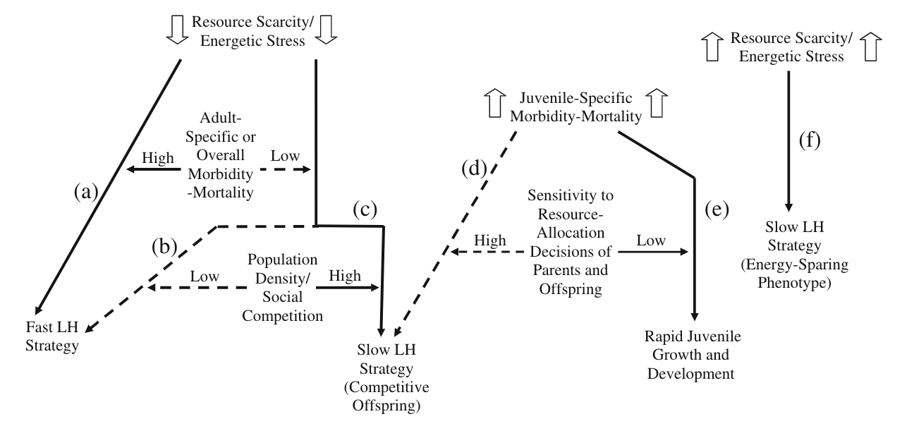
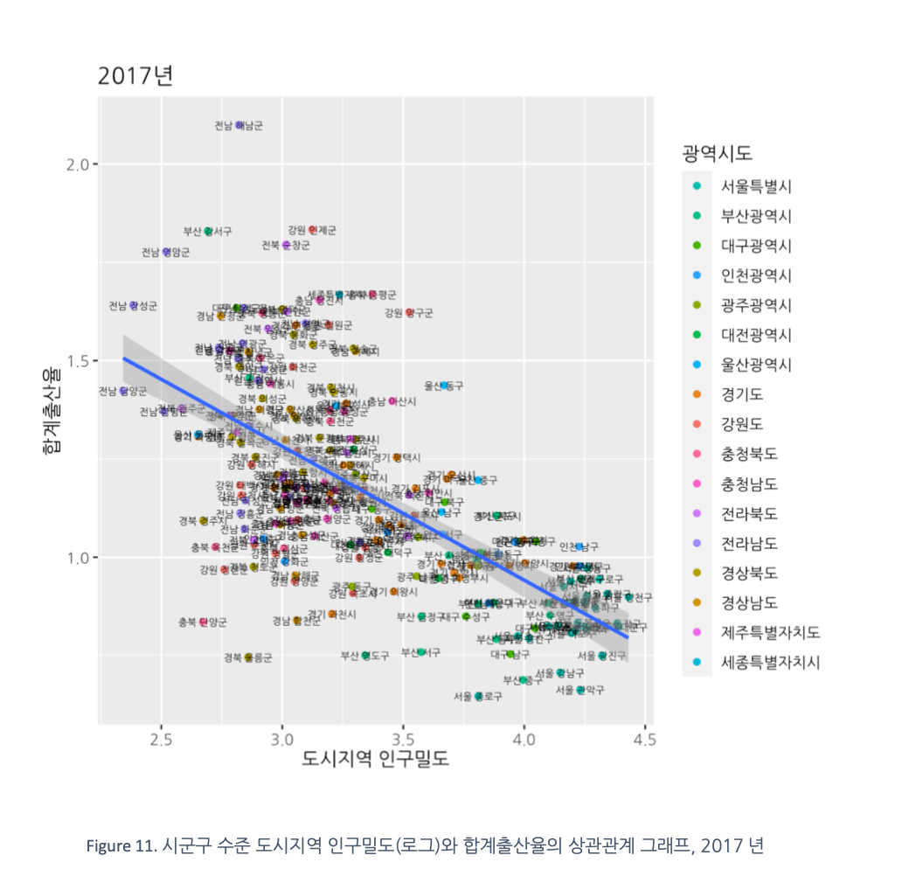
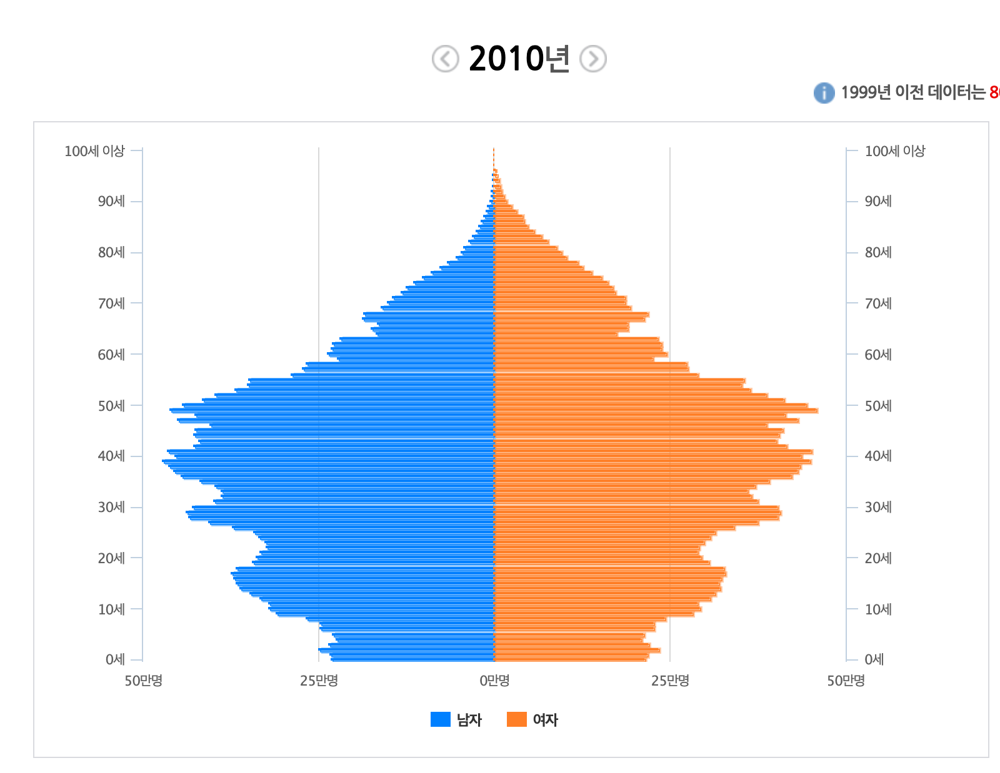
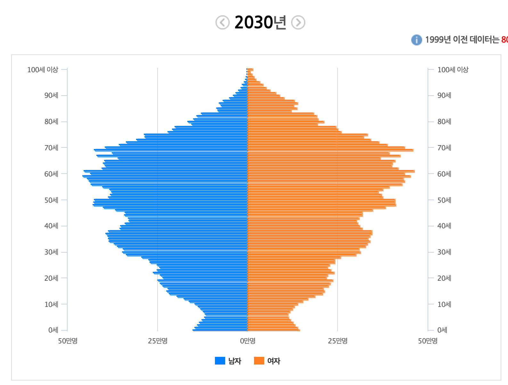
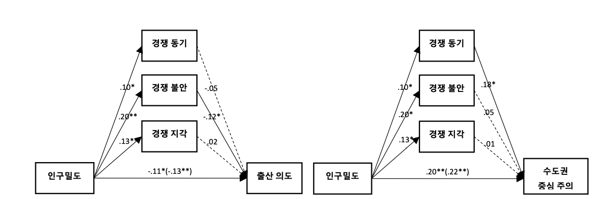
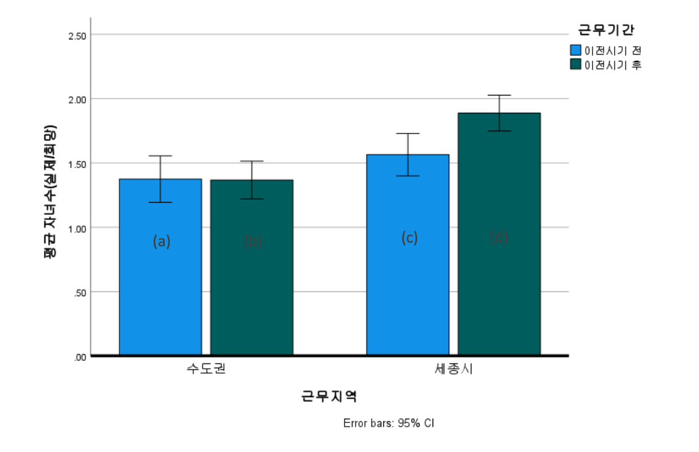
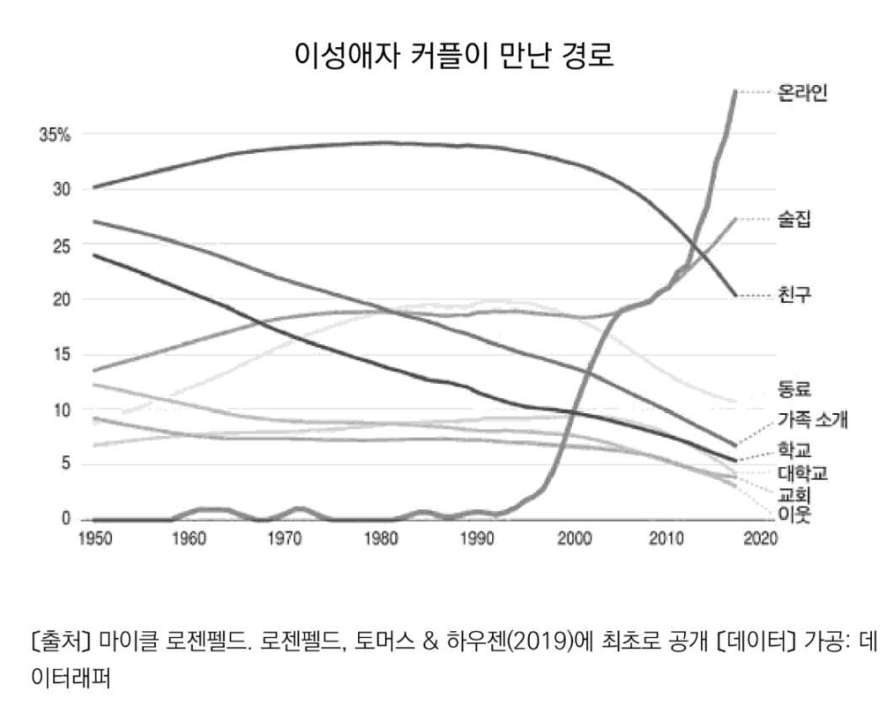
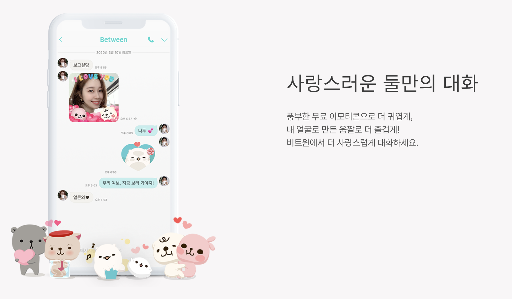

## 강의목표

- 생애사 이론과 근본동기 이해하기
- 근봉동기의 관점에서 서비스 분석하기

----

## 서비스와 인간 본성

- 사람들이 이 서비스를 왜 사용할까? 
- 나는 왜 이 서비스를 이용하는가?

---

## 토론

- 내가 요즘 관심있거나 가장 자주 사용하는 서비스는?
	- 그리고 그 서비스를 활용하는 이유

---

## 지난 시간 다시보기: 적응과 부산물 

::: {.columns}

::: {.column width="40%"}

:::

::: {.column width="50%"}
- 적응 = 기능 = 인간의 삶에 도움을 주는 것
- 부산물 = 적응이 아닌 것 = 문화의 '적응'일 수 있음.

- 적응과 부산물을 구분했다면 이번 시간에는 적응의 요인들을 세분화해서 살펴보자.
:::
:::

---

## 인간의 생애사와 서비스 {.smaller}

- 서비스가 인간에게 어떤 기능을 제공하는지에 따라 서비스의 생사가 결정됨
- 서비스의 효용은 인간의 삶에서 각기 어떤 문제들을 해결해주는가?
- 인간의 생애사라는 굵은 선을 먼저 따라가 보자.  

---

## 생애사 이론

- 자원이 한정되어 있다는 전제, trade-off
- 어느 전략을 채택할 것인가?

---

## *r*-selection and *K*-selection

- 생태학에서의 개념
  - *r*-selection vs. *K*-selection

---

## *r*-selection 과 *K*-selection의 특징{.smaller} 

|Features|*r*-selection|*K*-selection|
|:--:|:--:|:--:|
|Example|Bacteria, insects|Primates, including humans|
|Development|Rapid|Slow|
|Reproduction Rate|High|Low|
|Reproductive age|Early|Late|
|Body size|Small|Large|
|Reproductive type|Single reproduction|Repeated reproduction|
|Length of life|Short|Long|
|Competitive ablility|weak|Strong|

---

## fast(*r*) and slow(*K*) strategy (한 종 내에서)

- 한 종 내에서도 변이가 존재함
- 이러한 변이는 유전적인 부분도 영향을 주겠지만, 어떠한 환경에서 자랐는지에 따라서 변화할 수 있음.

--- 

## 생애사 전략 선택에 있어 환경의 역할

::: footer
참고자료 : [Ellis et al.(2009)](https://link.springer.com/article/10.1007/s12110-009-9063-7)
:::

---

## 생애사 전략 선택에 있어 환경의 역할 

- 주변 환경에서 자원이 풍부하고 성체의 평균 수명이 짧으면 fast 전략
  - 자원이 희소하면 slow 전략
- 자원이 풍부하고 성체의 수명이 길고 경쟁이 심하면 slow 전략
- 어릴때 사망률이 높은 환경에서 부모의 투자에 의해 사망률이 민감하다면 slow 전략
  - 아니라면 juvenile기의 빠른 성장과 발달 전략

---

## 전략과 자원할당

- 자원할당의 문제 
  - 지금이냐 나중이냐?(결혼 등)
  - 양(quantity)이냐 질(quality)이냐?(자녀)

- 인생(자녀까지도 포함)의 시간표를 정하는 문제
- 지금, 양 vs. 나중, 질
- 나중과 질을 선택했을 때 '투자'를 해야함. 
  - 어디에? -> 우리 몸에!

---

## Embodied capital

> Embodied capital can be defined as a stock of attributes embodied in the soma of an organism which can be converted, either directly or, more commonly, in combination with other forms of capital, into fitness-enhancing commodities

::: footer
참고자료 : [Kaplan et al.(1995)](https://link.springer.com/article/10.1007/BF02734205)
:::

---

## 동기(motivation)의 역할

- 인생의 시간표가 정해졌으면 지금 시점에서 해야할 것들을 해야하는데 이때 상황에 맞는 동기들이 발현되어 행동을 추동한다.

- 동기에 대한 이론들
  - 근본동기 이론
  - 매슬로우의 욕구이론

---

## 생애사 이론과 근본동기 이론

---

## 매슬로우 욕구이론 vs. 근본 동기 이론

::: {.columns}

::: {.column width="45%"}

:::

::: {.column width="45%"}

:::

:::

---

## 매슬로우 욕구이론의 한계

- 위계 구조에 있는 각 욕구들에 대해 진화적으로 궁극적인 원인을 제시하지 않는다.
- 욕구들이 독립적으로 작용하는 것으로 생각하게 만듦
- 더 상위의 욕구를 추구해야하는 것으로 생각하게 만듦

---

## 생애사 이론의 특징[^1] {.smaller}

- 욕구끼리 서로를 억제하고 촉진하기도 하는 관계
  - 양육 동기는 생리학적 동기를 억제하기도 함(Case et al., 2006)
    - 내 아이의 대변 냄새는 역겹다고 여기지 않는다(심지어 대변의 출처를 모른 상태에서도).
  - 생리학적 동기는 재생산 동기에 영향을 준다(성적 접촉은 일반적으로 타인의 체액과의 접촉을 수반하여 감염의 위험을 증가시킨다.)(Al-Shawaf et al., 2018; Fleischman, 2014; Phelan and Edlund, 2016; Tybur et al., 2013)
    - 파트너를 고를 때 감염병을 전달할 것 같은 파트너를 피하는 적응이 있음.
- 생애사 전략에 따라 세워진 시간표에 따라 우세한 동기가 있지만 여러 동기가 중첩되어 나타날 수도 있다.

[^1]: Shackelford, T. K. (Ed.). (2020). The SAGE Handbook of Evolutionary Psychology: Integration of Evolutionary Psychology with Other Disciplines. Sage.

---

## 매슬로우가 말한 자기 실현 욕구는?

- 자기실현의 욕구는 근본동기 이론에 직접적으로 매칭되지 않는다.
- 진화론에서의 자기 실현이라는 것은 궁극적 원인이 아니라 궁극적 원인(더 좋은 짝을 만나는 것, 자녀를 잘 양육하는 것 등)을 위한 수단(근접 원인)이라고 해석할 수 있다.
- 자기실현을 위해 애쓰는 것은 다른 적응적 메커니즘의 비적응적 결과물이라고 할 수 있음.
- 그러나 서비스나 사업을 운영함에 있어서는 궁극 원인에 대한 이해와 더불어 근접 원인에 대해서도 제대로 파악해야 한다는 측면에서 같이 참고하면 좋을 것.

---

## 자기실현 욕구와 Embodied capital의 축적

- 많은 교육 사업은 이러한 자기실현적 동기를 자극한다.
- 교육 서비스를 통해 질적으로 embodied capital이 축적되고,
- 이는 신규 사용자들에 대한 홍보 수단으로 사용됨.

---

## 생애사 이론과 인구학의 연관성{.smaller}

- 생애사 이론이 담당하는 미시적 마음구조가 모여 인구학에서 다루는 거시적 인구 현상이 나타남

::: {.columns}
::: {.column}
- [Oliver Sng의 연구](https://www.hbrkorea.com/article/view/atype/ma/category_id/6_1/article_no/1000)

:::
::: {.column}
- [2020 감사원 연구과제](https://policy.nl.go.kr/search/searchDetail.do?rec_key=SH2_PLC20210271097) 

:::
:::

---

## 인구 피라미드 변화

::: {.columns}

::: {.column width="50%"}

:::

::: {.column width="50%"}

:::

:::

::: footer
참고자료 : [[Link]](https://sgis.kostat.go.kr/jsp/pyramid/pyramid1.jsp)
:::

---

## 도시 소멸 지수

---

## 출산의도와 수도권 밀집에 대한 밀도효과

::: footer
[2020 감사원 연구과제](https://policy.nl.go.kr/search/searchDetail.do?rec_key=SH2_PLC20210271097)
:::

---

## 자연 실험(정부부처 이전)

::: footer
[2020 감사원 연구과제](https://policy.nl.go.kr/search/searchDetail.do?rec_key=SH2_PLC20210271097)
:::

---

## 인구학적 상상력과 시장 규모 추산

- 연령 분포가 어떻게 변하고 있는가?
- 공간적으로 분포가 어떻게 변하고 있는가?

. . .

- 동기의 구성과 지리적 분포가 어떻게 변하고 있는가?
- 동기를 가진 사람 = 실제로 돈을 낼 사람
- 시장의 지형이 어떻게 변하고 있는가?

---

## 인구학적 상상력을 바탕으로 한 사업/서비스 기획 

- 어떤 동기를 가진 타겟층을 어디서 만날 것인가?

::: {.columns}
::: {.column}

:::
::: {.column}

:::
:::

---

## 사례연구

- 사례 서비스들이 자극하는 근본동기가 무엇인지 알아보고 key feature에 대해 알아보자.
- 너무 당연한 사례들은 이야기 하지 않고, 동기가 숨어져 있거나 독특한 방식으로 동기를 활용한 사례를 중심으로 소개할 예정

- 사례들에 담겨 있는 동기들에 대해서 토론하는 시간

---

## 근본 동기들

- 즉각적인 생리학적 요구
- 자기 보호 동기
- 소속 동기
- 지위와 존중 동기
- 짝 획득 동기
- 짝 유지 동기
- 양육 동기

. . .

\+

. . .

- 자기실현의 동기

---

## 근본 동기와 IT 기술의 궁합

- 즉각적인 생리학적 요구
- 소속동기
- 짝 획득 동기
- 자기실현 동기

- 동기 분석은 B2C 사업에 더 적합하지만 end-user가 존재하는 B2B 사업들도 기획과 마케팅에서 동기 분석이 유용할 것!

---

## 즉각적인 생리학적 요구

- 의식주와 관련된 사업
  - 전 생애에 걸쳐 존재하는 상수(constant)와 같음.
  - 배달, 식재료 배송, 세탁물 수거배송, 숙박 등
  - 즉각적이지 않은 기호의 영역까지도 확장되고 있음.

- 감염의 위험을 가진 대상과 접촉하지 않으려는 동기

---

## 자기 보호 동기

- 타인이 가할 수도 있는 위해로부터 자신을 보호하고자 하는 동기
- 적은 확률이지만 일어날 수도 있는 위험에 대비하도록 해주는 장치들

---

## 자기 보호 동기

- 현대사회에서 자기 보호 동기는 개인만의 문제가 아니라 공공의 영역에 포함되기 때문에 사업의 영역보다는 정책과 같은 영역에서 해결해주는 문제

---

## 소속 동기

- 사회적 연결을 추구하고, 집단의 일원이 되며, 배제되는 것을 피하고자 하는 동기

- 대부분의 메신저와 SNS 서비스
- 소속이라는 것은 집단 안에서 계속된 소통을 통해 형성되는 것

- 다른 동기 영역에서 함께 이득이 되는 경우가 많다.(기존의 SNS 및 암호화폐 커뮤니티 등)  

---

## 지위/존중 동기

- 다른 이들로부터 존중을 받고 사회적 위계에서 상층으로 이동하고자 하는 동기

- 클럽하우스
  - 음성을 활용한 SNS
  - 희소재를 통한 지위 동기 자극(소속 동기와도 겹침)

. . . 

---

## 지위/존중 동기 

- 과시적 소비(명품 등)를 위한 플랫폼
- 과시적 소비에 대한 접근성이 높아지게 만듦

---

## 짝 획득 동기

::: {.columns}
::: {.column width="30%"}
- 연애 상대/성적 파트너/배우자를 찾고자 하는 동기 
- 수많은 채널들이 있으나 점점 온라인의 비중이 커지고 있음.
:::

::: {.column width="60%"}

:::
:::

---

## 짝 획득 동기

::: {.columns}
::: {.column width="50%"}
- 단기적 짝짓기 전략
  - 외모의 중요성
- 틴더 
  - 간결한 UI(스와이핑)로 새로운 상대를 빠르게 탐색할 수 있고 매칭할 수 있게 해줌
- azar
  - tinder의 화상 버전
::: 

::: {.column width="30%"}

:::
:::

---

## 짝 획득 동기

- 장기적 짝짓기 전략
  - 직업, 소득 등의 외부 조건을 중간에서 보증해주는 것이 필요함.
- 결혼 정보업체류의 어플들

---

## 짝 유지 동기

- 현재의 연인/성적 파트너/배우자와의 관계를 유지하려는 동기
- 비트윈

---

## 짝 유지 동기

- 개방형 메신저, SNS 라는 환경이 갖추어진 후 나타날 수 밖에 없음
- 연인 간에 서로에게 더 헌신하려는 동기를 자극한 서비스

- 획득, 유지 둘 중에 어느 시장이 클까?

---

## 양육 동기

- 동기 피라미드의 꼭대기
- 시간과 에너지를 들여 자녀나 가족의 일원을 돌보려는 동기
- 다양한 영유아 육아 및 교육 서비스 및 제품

---

## facebook의 사례(여러 동기를 자극할 수도 있음)

- 짝획득 동기
- 소속 동기
- 지위/존중 동기