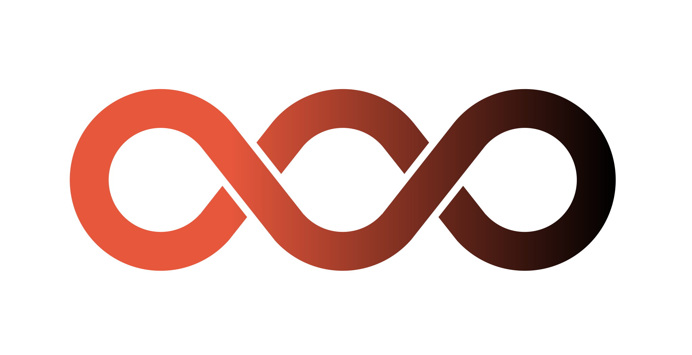

## 놀라운 사실

- 당신 머릿속에 있는 세포들이 이 단어들을 읽고 있다. 
- 이것이 얼마나 놀라운 일인지 한번 생각해보라.
- 단순한 세포로 만들어진 뇌가 어떻게 지능을 만들어내는가?

## 지난 시간 리뷰

- 진화이론이 자연을 넘어 인간의 마음과 생애에 어떻게 적용되는지 살펴보았음.

- 문화라는 새로운 공간을 여는데 기반이 된 뇌라는 신비한 물질에 대해서도 진화적 관점을 적용해 볼 것.

- 집단과 문화를 설명함으로써 창업활동과 서비스를 이야기 하 전 꼭 필요한 부분.

## 수업 목표

1. 뇌의 구조와 진화에 대한 기본적인 지식을 이해한다.
2. 뇌 속에서 표상이 만들어지고 의사결정이 이뤄지는 과정에 대해 이해한다.
3. 위의 관점이 창의성과 미래 지능의 발전에 대해 어떤 함의를 주는지 고찰해본다.

---

::: {.r-stack style="margin-top: 200px;"}
{width="450"}
:::

# 뇌의 구조와 진화

## 생명현상의 열쇠, DNA

- 다윈의 진화론, 멘델의 유전학이 합쳐졌지만 실제로 생명현상이 어떻게 이뤄지는지에 대해서 분자수준에서 설명할 수는 없었음.
- 크릭과 왓슨이 DNA 이중 나선 구조를 밝혀내고 이후 생물학은 이 DNA 가닥이 어떤 과정을 거쳐 발현되고 유전되는지를 통해 생명현상을 이해하기 시작했다.

## '뇌에 관한 생각'(1979) by 크릭

- 뇌과학의 현황에 대한 글
- "뇌가 여전히 수수께끼로 남아 있는 이유는 우리가 데이터를 충분히 얻지 못해서가 아니라 이미 손에 넣은 조각들을 어떻게 배열해야 할지 모르기 때문이다." 
- 이후 40여년이 지나는 동안 뇌에 관해 중요한 발견이 많이 있었지만 크릭의 전반적인 주장은 아직도 유효

## 뇌의 구조

## 뉴런과 시냅스

## 신피질의 구조

:watermark(/images/watermark_only_sm.png,0,0,0):watermark(/images/logo_url_sm.png,-10,-10,0):format(jpeg)/images/anatomy_term/horizontal-cell-of-cerebral-cortex/Uc5kuiG8Jx0wq1aKIRNZkw_Horizontal_cell_magni.png)

## 두뇌의 정보처리

- 특정 정보처리가 각기 두뇌의 특정 영역과 관련
- 분리는 불완전
- 병렬정보처리와 통합의 필요성

## 시각 영역

## 브로카, 베르니케 영역과 실어증

## 뇌전증과 뇌간 절제술

## 피니어스 게이지

## 뇌와 성격

- 피니어스 게이지(1823 ~ 1860)
- 뇌간을 다치지 않아 기적적으로 살아남았으나 대뇌 피질에 입은 손상때문에 성격과 행동양상이 완전히 변해서 '다른 사람'이라고 해도 이상하지 않을 정도가 되었다. 

## 뇌가 세상을 이해하는 방식

의식의 환상

<iframe src="https://www.youtube.com/embed/fjbWr3ODbAo" width=1000 height=600></iframe>

## 비교해부학적

## 비교행동학적

- 네안데르탈인과 사피엔스의 뇌 비교
- 절대적 크기와 함께 중요한 부분

## 뇌 크기 증가

---

::: {.r-stack style="margin-top: 200px; font-size: 40px;"}
{`What`} made us human?
:::

## 인간 독특성

- 커다란 뇌
- 이족보행
- 집단 형성
- 협력
- 도구 사용

## 뇌가 커질수 있었던 이유

- 핵심 혁신 가설
  - 생태적 요인 가설 : 요리 가설
  - 언어적 요인 가설
  - 사회적 요인 가설 : 번식적 협력 가설
  - 문화적 요인 가설 : 밈 가설
- 공진화적 가설
  - 원거리 무기 가설
  - 진화한 도제 가설

## 요리가설

Richard Wrangham

## 언어가설

Robin Dunbar

## 번식적 협력 가설 ≒ 할머니 가설

Sarah Hrdy

## 원거리 무기 가설

Peter Turchin

## 진화된 도제 가설

Kim Sterelny

## 밈 가설

Susan Blackmore

## 정리

- 뇌는 다양한 인간 독특성의 기반
- 작은 신경세포들로 이뤄진 뇌가 생각하는 방식은?

---

::: {.r-stack style="margin-top: 200px;"}
{width="450"}
:::

# 천 개의 뇌

## 오래된 뇌와 새로운 뇌

- 오래된 뇌는 파충류의 뇌라고 할 수 있음.
- 악어는 신피질을 가지고 있지 않지만 복잡한 행동을 하고, 새끼를 돌보며, 자신이 살아가는 환경에서 잘 돌아다니는 법을 안다.
- 새로운 뇌는 신경 섬유를 통해서 오래된 뇌와 연결되어 있음.
- 두 뇌는 룸메이트 관계, 협력하기도 하고 싸우기도 함.

## 신피질에 대한 연구 요약

- 신피질의 국지적 회로는 복잡하다.
- 신피질은 어디서나 겉모습이 서로 비슷하다.
- 모든 신피질 영역은 움직임을 만들어낸다.

## 버넌 마운트캐슬의 개념

- 긴 진화시간에 걸쳐 오래된 뇌 부분 위에 새로운 뇌 부분을 추가하면서 점점 뇌가 커짐.
- 공통의 피질 알고리듬을 주장한 처음 사람
- 지능의 다양성을 한 가지 기본 알고리듬으로 설명 시도

## 피질 기둥(cortical column)

- 피질 기둥과 소기둥

:::{.r-stack}

:::

## 공통 알고리듬의 근거

- 신피질 모든 곳의 세부 회로가 놀랍도록 비슷
- 호미니드 조상에 비해 현생 인류의 신피질이 크게 팽창한 사건이 진화사에서 아주 짧은 시간에 해당하는, 불과 수백만 년 동안에 일어났다는 사실.
  - 이것은 진화가 새롭고 복잡한 능력을 많이 발견하기에 충분한 시간은 아니지만, 동일한 것을 더 많이 복제하기에는 충분한 시간
- 각 신피질 영역의 기능이 확고하게 정해져 있지 않다는 사실
  - 예를 들면, 시각 장애를 안고 태어난 사람들의 경우, 신피질에서 시각 영역은 눈에서 유용한 정보를 받지 않는다.

## 우리 머릿속의 세계 모형

## 자신의 비밀을 드러내는 뇌

## 뇌 속의 지도

## 개념, 언어, 고차원 사고

## 지능에 관한 천 개의 뇌 이론

---

::: {.r-stack style="margin-top: 200px;"}
{width="450"}
:::

# 지능과 창의성에 대한 **진화론적** 이해

---

::: {.r-stack style="margin-top: 200px;"}
{width="450"}
:::

# section

---

::: {.r-stack style="margin-top: 200px;"}
{width="450"}
:::

# 강의 요약

## 강의 요약

--- 

::: {.r-stack style="margin-top: 200px;"}
{width="450"}
:::

